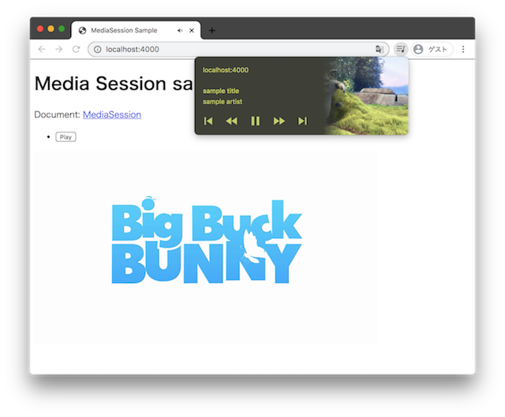

# Media session sample / Global Media Control

Experiment "Global Media Control"



## Development

server

```bash
python3 -m http.server 4000 --directory ./docs 
```

format

```bash
prettier --write ./docs/*.html
```

